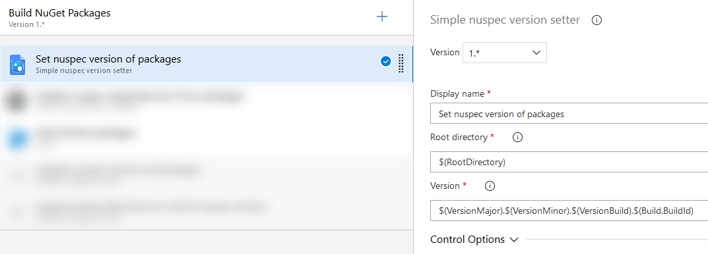

# Simple Nuspec Version Setter

This build task simply sets all nuspec files versions found in the given root directory (and below folders) to the one given in the task.

Thats it, simple, no magic at all.

# Download
Install via Visual Studio / Azure DevOps Marketplace @ https://marketplace.visualstudio.com/items?itemName=AlexanderSchmid.simplenuspecversionsetter